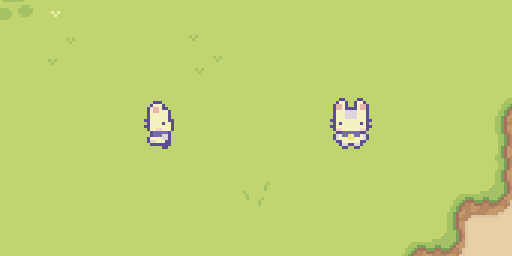

<div align="center">
  
  <h1>PixelPal</h1>
  <h3>Play with ChatGPT!</h3>

  [](https://discord.gg/jwb26Xy5M7)

</div>

## Description
This project integrates GPT-4 into a video game, where it serves as a dynamic and helpful in-game companion. Powered by Rust and Bevy, it's a modern and exciting adventure waiting to unfold.

## Setup & Running

### Prerequisites
- [Rust](https://www.rust-lang.org/)
- [Cargo](https://www.rust-lang.org/)
- [ChatGPT API Key](https://platform.openai.com/)

### Step 1: Clone the Repository

Clone this repository to your local machine using Git.

```bash
git clone https://github.com/chaoxel/PixelPal.git
```

### Step 2: Setup Your API Key

Navigate to the project directory and open the .env file.  
Add your API key as shown below:

```bash
# YOUR KEY HERE
GPT_KEY=sk-..
```

### Step 3: Compile & Run

You can now compile and run the project.
```bash
cargo run --release
```

## License
All Rights Reserved by [Chaoxel](https://github.com/chaoxel/).
